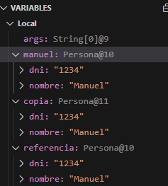

# 24-25-EDA1-ExamenParcial

## Pregunta 3: referencias y constructores

### a) ¿Cuántos objetos Persona diferentes hay en memoria? Justifique su respuesta.
### Hay 2 objetos persona en la ejecución del código, manuel es una de ellas, la copia es la otra persona, y la referencia sigue siendo el primer manuel, esto se puede entender mejor usando debug, lo cual nos muestra: 
### 
### b) Si hacemos `manuel.setNombre("Manuel Antonio")`, ¿qué elementos de la lista se verán afectados? ¿Por qué?
### Los elementos afectados seran manuel y la referencia a manuel, al añadir la funcion al codigo se observa como la salida cambia este objeto además de como se queda intacta la copia. 
### Nombre: Manuel Antonio, DNI: 1234
### Nombre: Manuel, DNI: 1234
### Nombre: Manuel Antonio, DNI: 1234

