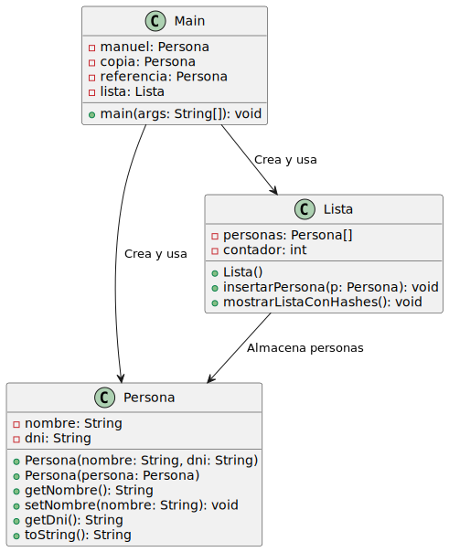

# Respuesta a la pregunta número 3

## **a) ¿Cuántos objetos `Persona` diferentes hay en memoria? Justifique su respuesta.**

### Respuesta:

En memoria hay **2 objetos `Persona` diferentes**.

### Justificación:

1. **Creación del objeto `manuel`:**
   ```java
   Persona manuel = new Persona("Manuel", "1234");
   ```

Este código crea un nuevo objeto Persona en memoria con los valores "Manuel" y "1234". Este es el primer objeto Persona que ocupa un espacio único en memoria.


2. **Creación del objeto `copia`:**
   ```java
   Persona copia = new Persona(manuel);
   ```

Aquí se utiliza el constructor de copia para crear un nuevo objeto independiente con los mismos valores iniciales que manuel. Esto significa que copia ocupa un espacio distinto en memoria. Ya tenemos 2 objetos independientes hasta ahora.

3. **Creación del objeto `referencia`:**
   ```java
   Persona referencia = manuel;
   ```

En este caso, no se crea un nuevo objeto. La referencia simplemente apunta al mismo objeto en memoria que manuel. Esto significa que referencia y manuel comparten el mismo espacio de memoria.

4. **Inserción en la lista:**
   ```java
    lista.insertarPersona(manuel);
    lista.insertarPersona(copia);
    lista.insertarPersona(referencia);
   ```

Por lo tanto, en total, hay 2 objetos Persona diferentes en memoria: uno referenciado por manuel (y también por referencia), y otro referenciado por copia.


## **b)  Si hacemos `manuel.setNombre("Manuel Antonio")`, ¿qué elementos de la lista se verán afectados? ¿Por qué?**

Al hacer manuel.setNombre("Manuel Antonio"), se verán afectados los elementos referenciados por `manuel` y `referencia`, pero no el elemento referenciado por `copia`.

1. **Modificación del nombre de `manuel`:**
   ```java
   manuel.setNombre("Manuel Antonio");
   ```

Aquí se está modificando el atributo nombre del objeto al que apunta la referencia manuel.
Como referencia apunta al mismo objeto que manuel, cualquier cambio hecho a través de manuel también será reflejado en referencia.

2. **Copia no se ve afectada:**

Copia es un objeto independiente creado con el constructor de copia. Este objeto tiene su propio espacio en memoria, por lo que no comparte datos con el objeto al que apuntan manuel y referencia.

3. **Evidencia en el código:**

El hash de manuel y referencia será el mismo, indicando que comparten el mismo objeto.
El hash de copia será diferente, indicando que es un objeto independiente, se puede demostrar ejecutando el siguiente código.
 [Enlace al código usando hash](./src/Main.java)

**Diagrama UML del código**

 

