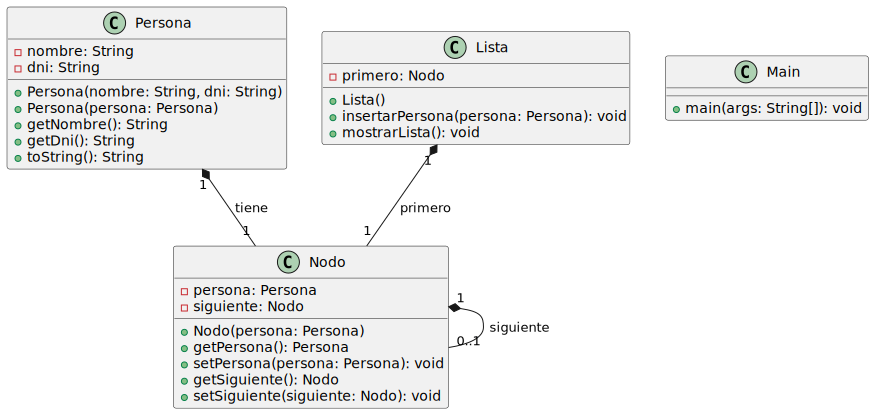

### **Pregunta 3: referencias y constructores**

#### **a) ¿Cuántos objetos Persona diferentes hay en memoria? Justifique su respuesta.**

### ¿Cuántos objetos Persona diferentes hay en memoria?

En el código proporcionado, se crean **tres referencias** a objetos `Persona`: `manuel`, `copia` y `referencia`. Vamos a analizar cuántos objetos `Persona` diferentes existen en memoria y por qué:

1. **`manuel`**: Se crea un objeto nuevo de tipo `Persona` con los valores `"Manuel"` y `"1234"`. Este objeto es único en memoria.

2. **`copia`**: Se crea usando el constructor de copia de la clase `Persona`. Este constructor toma los valores del objeto `manuel` y crea un **nuevo objeto en memoria** con los mismos atributos (`nombre` y `dni`). Por lo tanto, `copia` es un objeto independiente en memoria.

3. **`referencia`**: Se asigna la referencia del objeto `manuel`. Esto significa que `referencia` **no crea un nuevo objeto**; simplemente apunta al mismo objeto que `manuel`.

### Total de objetos `Persona` en memoria:
- Uno creado por `manuel`.
- Uno creado por `copia` usando el constructor de copia.

Por lo tanto, en total hay **2 objetos `Persona` diferentes en memoria**.

### Justificación:
- `manuel` y `referencia` apuntan al mismo objeto.
- `copia` es un objeto independiente, creado por el constructor de copia.

#### **b) Si hacemos manuel.setNombre("Manuel Antonio"), ¿qué elementos de la lista se verán afectados? ¿Por qué?**

Si ejecutamos el código `manuel.setNombre("Manuel Antonio")`, los elementos que se verán afectados en la lista son los siguientes:

1. **`manuel`**: El objeto `manuel` tendrá su atributo `nombre` actualizado a `"Manuel Antonio"`, ya que estamos llamando a `setNombre` sobre este objeto directamente.

2. **`referencia`**: Dado que la variable `referencia` apunta al mismo objeto que `manuel` (es decir, `referencia` es una **referencia al mismo objeto en memoria**), el cambio en el nombre de `manuel` también afectará al objeto al que `referencia` apunta. Por lo tanto, el atributo `nombre` de `referencia` también cambiará a `"Manuel Antonio"`.

3. **`copia`**: El objeto `copia` no se verá afectado. Esto se debe a que `copia` es un **objeto independiente** creado mediante el constructor de copia. Cuando se crea un nuevo objeto con el constructor de copia, se hace una **copia superficial** de los valores de los atributos de `manuel`, pero no mantiene ninguna referencia a `manuel` ni a sus atributos. Por lo tanto, el nombre de `copia` no cambiará y seguirá siendo `"Manuel"`.

### Respuesta Final:
- **Se verán afectados** los elementos `manuel` y `referencia` en la lista.
- **No se verá afectado** el elemento `copia`, ya que es un objeto independiente creado a partir de `manuel`.

### Justificación:
- `referencia` apunta al mismo objeto que `manuel`, por lo que cualquier cambio en uno afecta al otro.
- `copia` es un objeto nuevo y separado, por lo que su atributo `nombre` no se verá modificado.