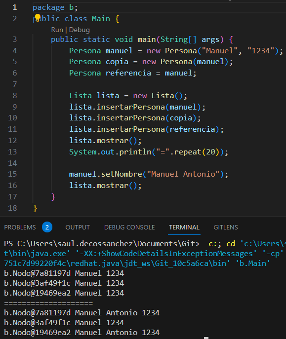

# Utilizando [Implementacion A](src/a)
## a) ¿Cuántos objetos Persona diferentes hay en memoria? Justifique su respuesta.
Utilizando la implementacion A hay 5 objetos persona diferentes, que se crean al hacer: 
```java
Persona manuel = new Persona("Manuel", "1234");
Persona copia = new Persona(manuel);

lista.insertarPersona(manuel);
lista.insertarPersona(copia);
lista.insertarPersona(referencia);
```
Ademas de crearse objetos Persona al crear las personas, al añadirlas a la lista, se crea un nuevo nodo, que a su vez, en esta implementacion, crea un nuevo objeto persona con los mismos datos.
## b) Si hacemos manuel.setNombre("Manuel Antonio"), ¿qué elementos de la lista se verán afectados? ¿Por qué?
No se vera afectado ningun elemento de la lista, ya que al añadir la persona a la lista, se crea una nueva, por lo que modificarla despues de añadirla, modificaria la persona que hay en el main pero no la que esta en el nodo de la lista.


# Utilizando [Implementacion B](src/b)
## a) ¿Cuántos objetos Persona diferentes hay en memoria? Justifique su respuesta.
Utilizando la implementacion B hay 2 objetos persona diferentes, que se crean al hacer: 
```java
Persona manuel = new Persona("Manuel", "1234");
Persona copia = new Persona(manuel);
```

## b) Si hacemos manuel.setNombre("Manuel Antonio"), ¿qué elementos de la lista se verán afectados? ¿Por qué?
Se vera afectado tanto manuel, ya que es al que se le esta modificando el nombre, como referencia, ya que es una referencia al objeto manuel.
