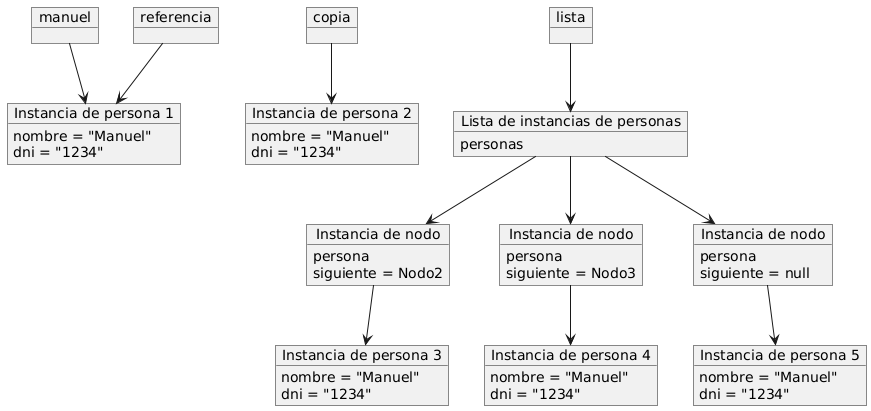
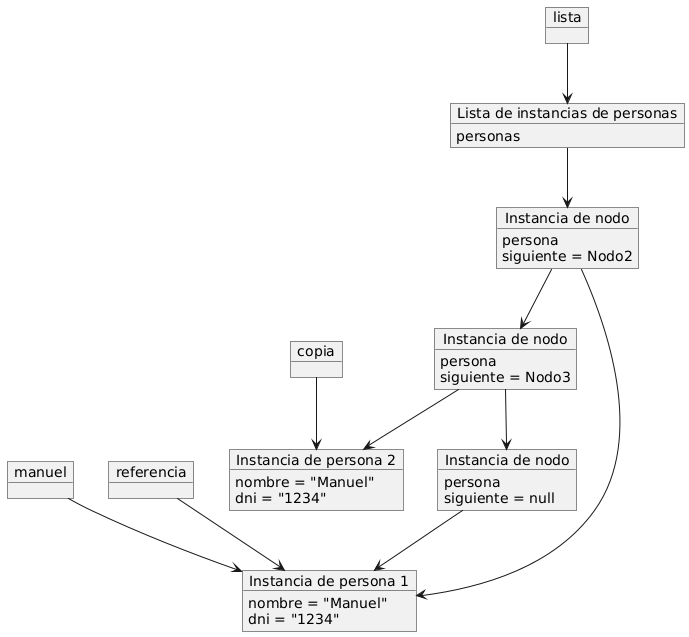
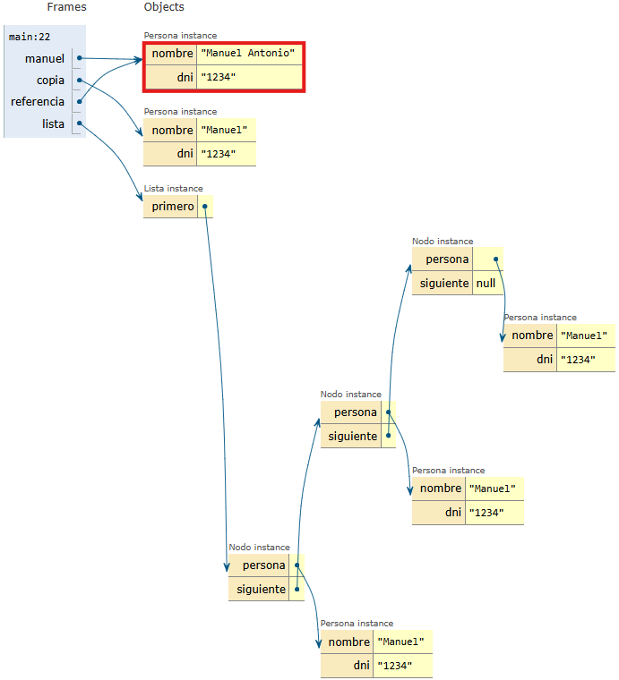
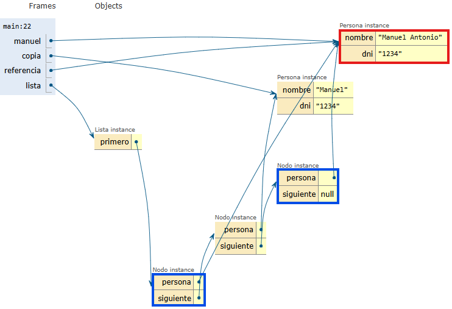

# Respuestas a las preguntas planteadas - Pregunta 3

## Pregunta 3: referencias y constructores

Analice este código:

```java
public class Persona {
    private String nombre;
    private String dni;
    
    public Persona(String nombre, String dni) {
        this.nombre = nombre;
        this.dni = dni;
    }
    
    public Persona(Persona persona) {
        this.nombre = persona.nombre;
        this.dni = persona.dni;
    }
}

public class Principal {
    public static void main(String[] args) {
        Persona manuel = new Persona("Manuel", "1234");
        Persona copia = new Persona(manuel);
        Persona referencia = manuel;
        
        Lista lista = new Lista();
        lista.insertarPersona(manuel);
        lista.insertarPersona(copia);
        lista.insertarPersona(referencia);
    }
}
```

|a) ¿Cuántos objetos Persona diferentes hay en memoria? Justifique su respuesta.|
|-|

- Para la [implementación A](../src/implementacionA) de la primera pregunta, hay 5 objetos *Persona* de la clase [Persona](../src/implementacionA/Persona.java) diferentes en memoria, uno es *manuel*, otro es *copia*, otro es *referencia*, y los otros dos son los que se crean al momento de la implementar el siguiente nodo en la lista. Esto es porque en el constructor de la clase [Nodo](../src/implementacionA/Nodo.java) se crea un nuevo objeto independientemente de si se hace referencia al los mismos datos de los objetos.



- Para la [implementación B](../src/implementacionB) de la primera pregunta, hay 2 objetos *Persona* de la clase [Persona](../src/implementacionB/Persona.java) diferentes en memoria, uno es *manuel* y el otro es *copia*. *referencia* no es un objeto *Persona* diferente, sino que es una referencia al objeto *manuel*. Esto es así puesto que en el código de la clase [Nodo](../src/implementacionB/Nodo.java) se hace una referencia al mismo objeto persona.



|b) Si hacemos `manuel.setNombre("Manuel Antonio")`, ¿qué elementos de la lista se verán afectados? ¿Por qué?|
|-|

- Para la [implementación A](../src/implementacionA) no se ve afectada la lista y sólo se verá afectado el objeto *Persona* del [Main.java](../src/implementacionA/Main.java) *manuel* ya que es el objeto creado a partir del constructor de la clase [Nodo](../src/implementacionA/Nodo.java) que crea un nuevo objeto cada vez que se crea un nuevo nodo.



- Para la [implementación B](../src/implementacionB) se verán afectados los elementos de la lista *manuel* y *referencia* debido a que ambos apuntan al mismo objeto *Persona*, en cuyo caso es *manuel*, por lo que ahora ambos tendrán el nombre "Manuel Antonio" de la lista, además del propio objeto *Persona*.

