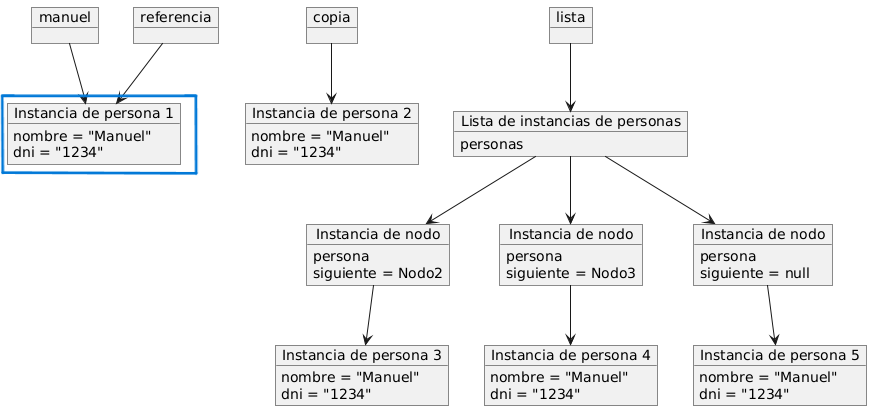
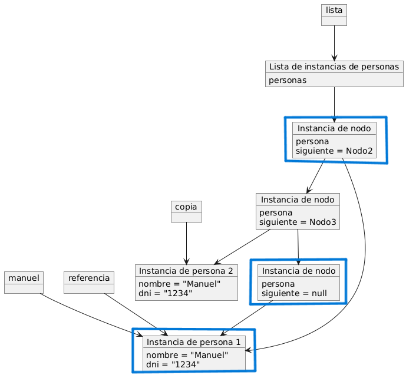

# Pregunta 3, respuesta bien planteada

## Pregunta 3: referencias y constructores

Analice este código:

```java
public class Persona {
    private String nombre;
    private String dni;

    public Persona(String nombre, String dni) {
        this.nombre = nombre;
        this.dni = dni;
    }

    public Persona(Persona persona) {
        this.nombre = persona.nombre;
        this.dni = persona.dni;
    }
}

public class Principal {
    public static void main(String[] args) {
        Persona manuel = new Persona("Manuel", "1234");
        Persona copia = new Persona(manuel);
        Persona referencia = manuel;

        Lista lista = new Lista();
        lista.insertarPersona(manuel);
        lista.insertarPersona(copia);
        lista.insertarPersona(referencia);
    }
}
```

---

### Implementaciones a tener en cuenta

**Implementación A**

```java
class Nodo {
    private Persona persona;
    private Nodo siguiente;

    public Nodo(Persona persona, Nodo siguiente) {
        this.persona = new Persona(persona.getNombre(), persona.getDni());
        this.siguiente = siguiente;
    }
}
```

**Implementación B**

```java
class Nodo {
    private Persona persona;
    private Nodo siguiente;

    public Nodo(Persona persona, Nodo siguiente) {
        this.persona = persona;
        this.siguiente = siguiente;
    }
}
```

---

### Preguntas:

| a) ¿Cuántos objetos Persona diferentes hay en memoria? Justifique su respuesta. |
| ------------------------------------------------------------------------------- |

---

| _Implementación A_ | Explicación                                                                                                                                                                                                                                                                                                                                                                                                                                                         | _Implementación B_ | Explicación                                                                                                                                                                                                                                                                                                 |
| ------------------ | ------------------------------------------------------------------------------------------------------------------------------------------------------------------------------------------------------------------------------------------------------------------------------------------------------------------------------------------------------------------------------------------------------------------------------------------------------------------- | ------------------ | ----------------------------------------------------------------------------------------------------------------------------------------------------------------------------------------------------------------------------------------------------------------------------------------------------------- |
| Hay 5 objetos      | Hay 5 objetos, al inicio se crean 2 personas diferentes, `manuel` y `copia`, la referencia apunta al mismo objeto que `manuel`, al usar `lista.insertarPersona`, el constructor crea una copia de cada objeto(persona) por ende también crea una copia de "copia" y luego al volver a insertar otra referencia, como apunta a `manuel`, el nodo vuelve a crear a otra copia de `manuel`, así que serían: 2 al crear, 3 al usar `lista.insertarPersona` = 5 objetos, | Hay 2 objetos      | Hay 2 personas diferentes, ya que de inicio se crean 2 personas, `manuel` y `copia`, y se indica la referencia será de `manuel`, así que al momento de llamar a `lista.insertarPersona` se mandará a llamar unicamente a `manuel` y `copia`, aunque se agregarían "3 personas" en realidad, solo existen 2. |

**Diagrama implementación A, demostrando que hay 5 personas**


**Diagrama implementación B, demostrando que hay 2 personas**


---

| b) Si hacemos `manuel.setNombre("Manuel Antonio")`, ¿qué elementos de la lista se verán afectados? ¿Por qué? |
| ------------------------------------------------------------------------------------------------------------ |

---

| _Implementación A_                             | ¿Por qué?                                                                                                                                                                         | _Implementación B_                                         | ¿Por qué?                                                                                                                                                                                                   |
| ---------------------------------------------- | --------------------------------------------------------------------------------------------------------------------------------------------------------------------------------- | ---------------------------------------------------------- | ----------------------------------------------------------------------------------------------------------------------------------------------------------------------------------------------------------- |
| Se vería afectado solamente el objeto `manuel` | Se debe ya que el nodo crea una copia independiente de cada objeto `persona`. Por ende, como no están vinculadas, los cambios que se le hagan a `manuel` no afectan a las copias. | Se verían afectados los elementos: `manuel` y `referencia` | Porque al inicio se llama `manuel` y la `referencia`, debido a que se indica, manuel(indica hacia quien). setNombre("Manuel Antonio") (esto quiere decir que se cambia), y la referencia apunta a `manuel`. |

**Diagrama implementación A, demostrando que afecta al objeto `manuel`**


**Diagrama implementación B, demostrando que afecta a los objetos `manuel` y `referencia`**

