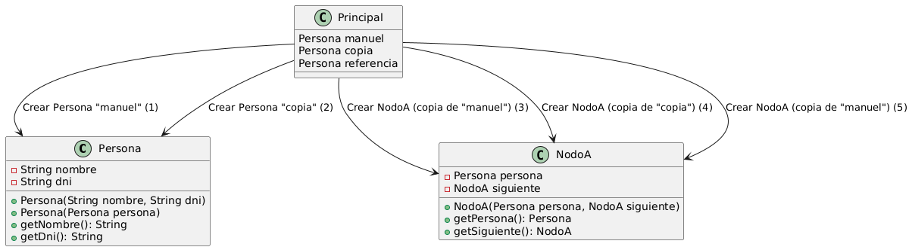
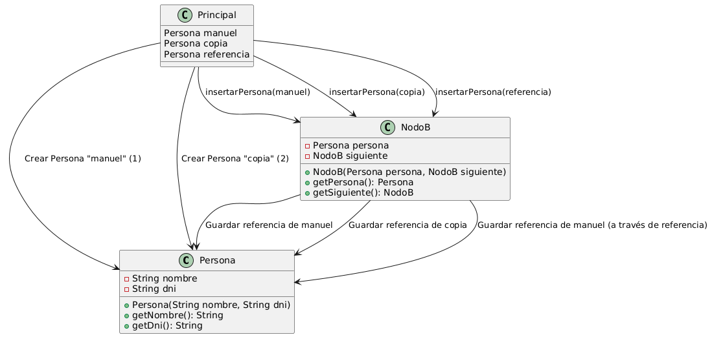

## Repuesta para examen Parcial 

P## Pregunta 1: análisis de implementaciones

Observe los siguientes fragmentos de código que implementan un nodo para una lista enlazada:

**Implementación A**

```java
class Nodo {
    private Persona persona;
    private Nodo siguiente;
    
    public Nodo(Persona persona, Nodo siguiente) {
        this.persona = new Persona(persona.getNombre(), persona.getDni());
        this.siguiente = siguiente;
    }
}
```

**Implementación B**

```java
class Nodo {
    private Persona persona;
    private Nodo siguiente;
    
    public Nodo(Persona persona, Nodo siguiente) {
        this.persona = persona;
        this.siguiente = siguiente;
    }
}
```

||
|-
a) ¿Qué implementación considera que utiliza mejor los recursos de memoria? Justifique su respuesta.
Si consideramos la implementación A, en su constructor nos muentras como por cada nodo que se esta creando, se esta generando una copia de la instancia de Persona, lo que indica que al crearla consume mayor memoria, mas en el caso que haya muchos nodos en esa lista.

Por otro lado en el caso de la implementación B, en el constructor esta haciendo referencia a la misma persona mas especificamente en this.persona = persona; , lo que si reduce el consumo de memoria al no crear una nueva como en el caso A.

**Ventajas de la Implementación A:**

- Cada nodo contiene su propia copia del objeto `Persona`, evitando efectos secundarios. Esto asegura que los datos en cada nodo sean independientes. Por ejemplo, si un nodo modifica un atributo de `Persona`, dicho cambio no impactará otros nodos ni alterará el objeto original.
  
- La independencia de los nodos también protege la integridad de la información en la lista enlazada. Si `Persona` representa un conjunto de datos delicados, como información confidencial de usuarios, los nodos aislados previenen que un cambio externo afecte todos los nodos.

**Desventajas de la Implementación A:**

- La duplicación de `Persona` en cada nodo aumenta el consumo de memoria. En sistemas con limitaciones de recursos o si `Persona` es una clase compleja, esto puede ralentizar la creación de nodos y aumentar el tiempo de procesamiento. Por ejemplo, en una lista de 1,000 nodos, cada uno replicando una clase `Persona` con varios atributos y métodos, la memoria requerida podría ser considerable.

**Ventajas de la Implementación B:**

- Al referenciar una sola instancia de `Persona` en cada nodo, se ahorra memoria. Esto es beneficioso en aplicaciones que manejan grandes volúmenes de datos y requieren eficiencia. Por ejemplo, en una lista que almacena contactos donde cada nodo comparte la misma instancia de `Persona`, el uso de memoria será mínimo.

- Los cambios en el objeto `Persona` se reflejan automáticamente en todos los nodos que lo referencian. Esto es útil si la lista enlazada necesita siempre la última versión de `Persona`. Por ejemplo, una lista de notificaciones donde cada nodo muestra el mismo perfil de usuario actualizado en tiempo real.

**Desventajas de la Implementación B:**

- La referencia compartida puede causar inconsistencias si cada nodo necesita datos únicos de `Persona`. Por ejemplo, si un nodo modifica el nombre de `Persona` fuera de la lista, todos los nodos que apuntan a esta instancia verán el cambio, lo cual puede no ser deseado en sistemas que requieren datos independientes en cada nodo.

Por ejemplo si simulamos nuestro main:

Persona persona = new Persona("Juan", "123456");
```java
// Implementación A

System.out.println("Implementación A:");

NodoA nodoA1 = new NodoA(persona, null);

NodoA nodoA2 = new NodoA(persona, nodoA1);

nodoA1.getPersona().setNombre("Carlos"); // Cambiamos el nombre en nodoA1

System.out.println("NodoA1 nombre: " + nodoA1.getPersona().getNombre()); // Carlos

System.out.println("NodoA2 nombre: " + nodoA2.getPersona().getNombre()); // Juan (independiente)

```

En la Implementación A, nodoA1 y nodoA2 tienen copias independientes de Persona. Cambiar el nombre en nodoA1 no afecta a nodoA2.

```java
// Implementación B

System.out.println("\nImplementación B:");

NodoB nodoB1 = new NodoB(persona, null);

NodoB nodoB2 = new NodoB(persona, nodoB1);

nodoB1.getPersona().setNombre("Maria"); // Cambiamos el nombre en nodoB1

System.out.println("NodoB1 nombre: " + nodoB1.getPersona().getNombre()); // Maria

System.out.println("NodoB2 nombre: " + nodoB2.getPersona().getNombre()); // Maria (compartido)

```
En la Implementación B, ambos nodos comparten la misma instancia de Persona. Cambiar el nombre en nodoB1 también cambia el nombre en nodoB2, ya que ambos apuntan al mismo objeto.

c) ¿Cómo afectaría cada implementación al comportamiento de una lista que use estos nodos?

En la **Implementación A**, el comportamiento de la lista se caracteriza por la independencia de datos en cada nodo, ya que cada nodo contiene una copia separada de `Persona`. Esto significa que cualquier cambio en un nodo no se reflejará en los demás, proporcionando flexibilidad para almacenar datos únicos en cada nodo. Sin embargo, esta independencia aumenta el consumo de memoria, lo que puede ser menos eficiente en listas grandes o cuando `Persona` es una estructura compleja.

En la **Implementación B**, todos los nodos comparten la misma instancia de `Persona`, lo que permite un uso eficiente de memoria y asegura que cualquier cambio en `Persona` se refleje en todos los nodos, ideal para listas donde los datos deben mantenerse actualizados de forma centralizada.

## Pregunta 2: gestión de referencias

Considere este código:

```java
class Lista {
    private Nodo primero;
    
    public void insertarPersona(Persona persona) {
        Nodo nuevo = new Nodo(persona, primero);
        primero = nuevo;
    }
    
    public boolean contiene(Persona persona) {
        Nodo actual = primero;
        while (actual != null) {
            if (actual.getPersona().getDni().equals(persona.getDni())) {
                return true;
            }
            actual = actual.getSiguiente();
        }
        return false;
    }
    
    public Persona obtenerPersona(String dni) {
        Nodo actual = primero;
        while (actual != null) {
            if (actual.getPersona().getDni().equals(dni)) {
                return actual.getPersona();
            }
            actual = actual.getSiguiente();
        }
        return null;
    }
}
```

a) Si tenemos:

```java
Lista lista = new Lista();
Persona juan = new Persona("Juan", "1234");
lista.insertarPersona(juan);
Persona personaEncontrada = lista.obtenerPersona("1234");
personaEncontrada.setNombre("Juan Manuel");
```
¿Qué nombre tendrá la persona almacenada en la lista? ¿Por qué?

La persona almacenada en la lista tendrá el nombre `"Juan Manuel".`

Cuando juan se inserta en la lista mediante `lista.insertarPersona(juan);`, el objeto juan se agrega como referencia en la lista. Esto significa que la lista simplemente almacena una referencia al mismo objeto en memoria.

Luego, al llamar a `btenerPersona("1234")`, se obtiene una referencia al mismo objeto Persona almacenado en la lista (que es juan).

Al ejecutar `personaEncontrada.setNombre("Juan Manuel");`, se modifica el nombre del objeto referenciado. Como personaEncontrada es una referencia al mismo objeto que juan en la lista, este cambio se refleja directamente en el objeto almacenado en la lista.

b) ¿Qué sucedería si modificamos:

```java
juan.setNombre("Juan Carlos");
```
después de insertarlo en la lista? ¿Depende de la implementación del Nodo que usemos (A o B de la pregunta anterior)?

Después de insertarlo en la lista, sí afecta al nombre de la persona almacenada en la lista, pero el efecto sí depende de la implementación del Nodo:

<Strong>Si el Nodo almacena una referencia al objeto Persona (Implementación A):</Strong> En este caso, juan y el objeto en la lista son la misma instancia, porque el Nodo guarda una referencia directa a juan.

Modificar `juan.setNombre("Juan Carlos");` cambiará el nombre del objeto en la lista también, ya que ambos (juan y la lista) apuntan al mismo objeto en memoria.

Esto es lo que ocurre en el código actual, donde la lista almacena directamente una referencia a Persona.

<Strong>Si el Nodo almacena una copia del objeto Persona (Implementación B):</Strong>

Si el Nodo creara una copia de juan al insertarlo, la lista tendría su propio objeto Persona, independiente de juan.

En este caso, modificar juan.setNombre("Juan Carlos"); no afectaría al nombre del objeto almacenado en la lista, porque la lista contiene una copia que no está conectada a juan.

Para que este comportamiento funcione, el Nodo tendría que implementar un mecanismo de copia, como un constructor de copia en Persona, cuando se inserta un nuevo objeto en la lista.


## Pregunta 3: referencias y constructores

Analice este código:

```java
public class Persona {
    private String nombre;
    private String dni;
    
    public Persona(String nombre, String dni) {
        this.nombre = nombre;
        this.dni = dni;
    }
    
    public Persona(Persona persona) {
        this.nombre = persona.nombre;
        this.dni = persona.dni;
    }
}

public class Principal {
    public static void main(String[] args) {
        Persona manuel = new Persona("Manuel", "1234");
        Persona copia = new Persona(manuel);
        Persona referencia = manuel;
        
        Lista lista = new Lista();
        lista.insertarPersona(manuel);
        lista.insertarPersona(copia);
        lista.insertarPersona(referencia);
    }
}
```

||
|-
a) ¿Cuántos objetos Persona diferentes hay en memoria? Justifique su respuesta.

Al ejecutar el código de las clases Principal y Persona con los nodos A y B ya en codigo se obtuvieron los siguientes resultados: 

**diagrama de como se usa el nodo A**


**diagrama de como se usa el nodo B**


Ahora ¿Porque pasa esto?: 
Para ello vamos a hacer un comparativa entre el nodo A y B donde la clases muestra segun el flujo la ejecución de la creación de referencia y objetos.

Nodo A

| Clase (`Principal`)            | ¿Qué contiene?                                  | ¿Se ha creado un nuevo objeto?               | ¿Qué contiene?                                      |
|--------------------------------------|-----------------------------------------|-----------------------------------------|-----------------------------------------------------------------|
| `Persona manuel = new Persona(...)`  | Se crea el objeto `manuel`.             | **Sí**                                  | Primer objeto `Persona` con `nombre = "Manuel", dni = "1234"`. |
| `Persona copia = new Persona(...)`   | Se crea el objeto `copia`.              | **Sí**                                  | Segundo objeto `Persona`, copia de los valores de `manuel`.     |
| `Persona referencia = manuel;`       | `referencia` apunta a `manuel`.         | **No**                                  | `referencia` es una referencia al mismo objeto que `manuel`.    |
| `lista.insertarPersona(manuel);`     | Se inserta `manuel` en la lista.        | **Sí**                                  | Se crea una nueva copia de `manuel` para almacenarla en el nodo.|
| `lista.insertarPersona(copia);`      | Se inserta `copia` en la lista.         | **Sí**                                  | Se crea una nueva copia de `copia` para almacenarla en el nodo. |
| `lista.insertarPersona(referencia);` | Se inserta `referencia` en la lista.    | **Sí**                                  | Se crea una nueva copia de `manuel` (a través de `referencia`). |


Nodo B

| Clase (`Principal`)             | Acción                                  | ¿Se crea un nuevo objeto?               |  ¿Qué crea?                                      |
|--------------------------------------|-----------------------------------------|-----------------------------------------|-----------------------------------------------------------------|
| `Persona manuel = new Persona(...)`  | Se crea el objeto `manuel`.             | **Sí**                                  | Primer objeto `Persona` con `nombre = "Manuel", dni = "1234"`. |
| `Persona copia = new Persona(...)`   | Se crea el objeto `copia`.              | **Sí**                                  | Segundo objeto `Persona`, copia de los valores de `manuel`.     |
| `Persona referencia = manuel;`       | `referencia` apunta a `manuel`.         | **No**                                  | `referencia` es una referencia al mismo objeto que `manuel`.    |
| `lista.insertarPersona(manuel);`     | Se inserta `manuel` en la lista.        | **No**                                  | Se almacena la referencia de `manuel` en el nodo.               |
| `lista.insertarPersona(copia);`      | Se inserta `copia` en la lista.         | **No**                                  | Se almacena la referencia de `copia` en el nodo.                |
| `lista.insertarPersona(referencia);` | Se inserta `referencia` en la lista.    | **No**                                  | Se almacena la referencia de `manuel` (a través de `referencia`).|


b) Si hacemos `manuel.setNombre("Manuel Antonio")`, ¿qué elementos de la lista se verán afectados? ¿Por qué?

Si ejecutamos `manuel.setNombre("Manuel Antonio")`, los elementos de la lista que se verán afectados dependen de su relación con `manuel`:

- **Nodo A**: Incluye los objetos `manuel` y `referencia`. Ambos apuntan al mismo objeto en memoria, por lo que cualquier cambio realizado a través de `manuel` también afectará a `referencia`.
- **Nodo B**: Incluye el objeto `copia`, que fue creado como una copia independiente utilizando un constructor de copia. Este objeto es completamente autónomo y no refleja los cambios realizados en `manuel`, ya que ocupa una dirección de memoria diferente.

### Comparativa entre Nodo A y Nodo B

| **Aspecto**             | **Nodo A (`manuel` y `referencia`)** | **Nodo B (`copia`)**               |
|--------------------------|--------------------------------------|------------------------------------|
| **Ubicación en memoria** | Mismo objeto (comparten dirección)   | Objeto distinto (dirección única)  |
| **Efecto de cambios**    | Refleja el cambio                   | No refleja el cambio              |
| **Relación**             | Referencias al mismo objeto          | Copia independiente               |

Es decir que dependiendo del nodo se veria afectado:

En el nodo A afectaria persona manuel y referencia.

En el nodo B afectaria a referencia y manuel  y a insertarPersona (manuel) y insertarPersona(referencia)


## Pregunta 4: diseño y optimización

Proponga una implementación de una Lista que:

- Permita detectar si se está intentando insertar una referencia a una Persona que ya existe en la lista
Se pondria implementar en la clase persona que el Dni sea unico, ya que cada persona creada en la lista no podría tener el mismo dni si no distinto debido que es unico.

Se asegura que el dni sea único y se usa como identificador. Esto se hace sobrescribiendo los métodos equals y hashCode en la clase Persona para comparar personas basadas en el dni.

Tendríamos la clase Persona y  lista. 

- Permita elegir si queremos insertar una copia de la Persona o mantener la referencia

- Sea eficiente en el uso de memoria

Explique su diseño y justifique las decisiones tomadas.

## Pregunta 5: análisis de código

Dado este fragmento:

```java
public class GestorPersonas {
    private Lista lista;
    
    public void agregarPersona(Persona persona) {
        if (!lista.contiene(persona)) {
            lista.insertarPersona(persona);
        }
    }
    
    public Persona buscarPersona(String dni) {
        return lista.obtenerPersona(dni);
    }
}
```

||
|-
a) ¿Qué problemas potenciales ve en este código respecto al manejo de referencias?
El problema en GestorPersonas es que el método buscarPersona devuelve una referencia directa al objeto Persona almacenado en lista. Esto significa que cualquier modificación realizada en el objeto Persona fuera de la lista afectará directamente al mismo objeto dentro de la lista, lo que compromete la integridad de los datos.

b) ¿Cómo lo mejoraría para evitar modificaciones no deseadas de los objetos?

Para evitar modificaciones no deseadas, se podría implementar una copia de Persona al devolver el objeto. Así, cualquier cambio realizado en la instancia devuelta no afectará al objeto almacenado en la lista. 

c) Proponga una solución que proteja la integridad de los datos.

La mejor solución para proteger la integridad de los datos es hacer que la clase `Persona` sea **inmutable**, de modo que sus valores, como `nombre` y `dni`, no puedan modificarse una vez asignados en el momento de creación. Al diseñar `Persona` de esta forma, cualquier acceso a los objetos `Persona` desde `GestorPersonas` será seguro, ya que no podrán alterarse. Esto elimina la necesidad de crear copias adicionales, garantizando que los datos se mantengan consistentes y protegidos sin riesgos de modificaciones externas.
