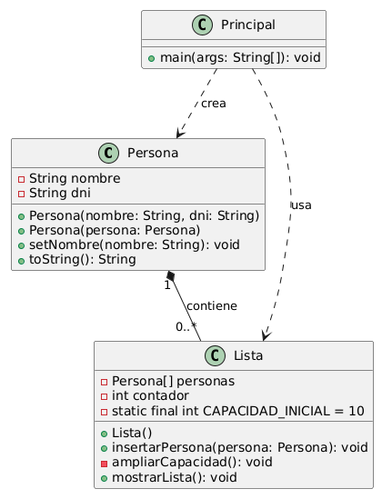

# Pregunta 3: referencias y constructores

a) ¿Cuántos objetos Persona diferentes hay en memoria? Justifique su respuesta. 

**Respuesta y Justificación:** En este código tenemos 2 objetos Personas diferentes y 1 una referencia a uno de ellos que serían: 
- **manuel:** Es el primer objeto Persona creado con el constructor normal.  
- **copia:** Es un nuevo objeto Persona creado con el constructor de copia. Aunque tiene los mismos valores que manuel, es un objeto independiente en memoria.  
- **referencia:** No es un nuevo objeto, sino una referencia al mismo objeto manuel.  

---

b) Si hacemos `manuel.setNombre("Manuel Antonio")`, ¿qué elementos de la lista se verán afectados? ¿Por qué?  

**Respuesta y Justificación:** Para lograr esto primero tendriamos que agregar un método `setNombre()` en la clase `Persona` ya que en el código proporcionado no lo tenemos y agregarlo afectaria dos elementos de la lista el que le corresponde a `manuel` y a `referencia` ya que estos dos apuntan al mismo objeto por otro lado tenemos `copia` que es un objeto independiente creado con el constructor de copia entonces cualquier cambio en `manuel` no le afectan.

---

En la siguiente ruta puedes encontrar el código que hace posible la pregunta b) y también el código completo:  

[Pregunta_3](../dylanNaranjo/Pregunta3.java)

---

## Diagrama UML  

