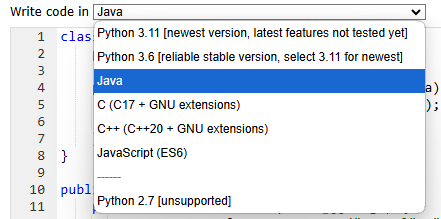

# Página de diagramas UML con Python:

## https://pythontutor.com/

Insertar los códigos dejados en los directorios [diagramaA](./diagramaA/DiagramaA.md) y [diagramaB](./diagramaB/DiagramaB.md) en la página de Python Tutor para ver los resultados.

Recuerde seleccionar la opción java para realizar su análisis.

Es una herramienta útil para mostrar a detalle y paso a paso cómo se generan los nodos junto a sus referencias.