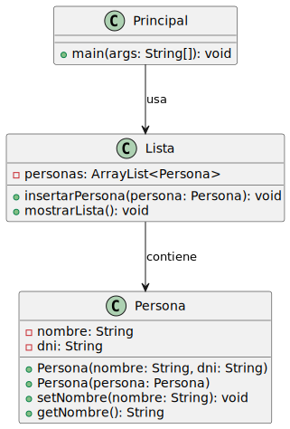

# Análisis de referencias y constructores en Java

## Analice este código:

```java
public class Persona {
    private String nombre;
    private String dni;

    public Persona(String nombre, String dni) {
        this.nombre = nombre;
        this.dni = dni;
    }

    public Persona(Persona persona) {
        this.nombre = persona.nombre;
        this.dni = persona.dni;
    }

    public void setNombre(String nombre) {
        this.nombre = nombre;
    }

    public String getNombre() {
        return nombre;
    }
}

public class Principal {
    public static void main(String[] args) {
        Persona manuel = new Persona("Manuel", "1234");
        Persona copia = new Persona(manuel);
        Persona referencia = manuel;

        Lista lista = new Lista();
        lista.insertarPersona(manuel);
        lista.insertarPersona(copia);
        lista.insertarPersona(referencia);
    }
}
```
||
|-
a) ¿Cuántos objetos Persona diferentes hay en memoria? Justifique su respuesta.
b) Si hacemos `manuel.setNombre("Manuel Antonio")`, ¿qué elementos de la lista se verán afectados? ¿Por qué?
||

a) ¿Cuántos objetos `Persona` diferentes hay en memoria?
--------------------------------------------------------

Para determinar el número de objetos creados en memoria, analicemos cada línea del código detenidamente.

### 1\. Línea: `Persona manuel = new Persona("Manuel", "1234");`

-   Aquí se invoca el constructor principal:

    ```java
    public Persona(String nombre, String dni) {
        this.nombre = nombre;
        this.dni = dni;
    }
    ```
-   Esto crea un nuevo objeto `Persona` en memoria con:
    -   `nombre = "Manuel"`
    -   `dni = "1234"`
-   Este objeto es único y está almacenado en memoria con una dirección específica.
-   La variable `manuel` es una referencia a este objeto.

* * * * *

### 2\. Línea: `Persona copia = new Persona(manuel);`

-   Aquí se invoca el constructor de copia:

    ```java

    public Persona(Persona persona) {
        this.nombre = persona.nombre;
        this.dni = persona.dni;
    }
    ```
-   Este constructor crea un nuevo objeto `Persona` en memoria, que copia los valores del objeto referenciado por `manuel`:
    -   `nombre = "Manuel"`
    -   `dni = "1234"`
-   Aunque los valores son iguales, este objeto es independiente porque ocupa otra dirección en memoria.
-   La variable `copia` es una referencia a este nuevo objeto.

* * * * *

### 3\. Línea: `Persona referencia = manuel;`

-   En este caso, no se crea un nuevo objeto.
-   La variable `referencia` simplemente apunta al mismo objeto que ya está referenciado por `manuel`.
-   En Java, las variables de tipo objeto solo almacenan direcciones de memoria, no los datos directamente. Por lo tanto, cualquier cambio realizado a través de `manuel` también será visible desde `referencia`.

* * * * *

### Conclusión:

1.  Se han creado dos objetos `Persona` diferentes en memoria:

    -   El primer objeto, creado con `new Persona("Manuel", "1234")`, está referenciado por `manuel` y `referencia`.
    -   El segundo objeto, creado con `new Persona(manuel)`, está referenciado por `copia`.
2.  La variable `referencia` no representa un nuevo objeto, sino que comparte el mismo espacio en memoria que `manuel`.

* * * * *

b) Si hacemos `manuel.setNombre("Manuel Antonio")`, ¿qué elementos de la lista se verán afectados?
--------------------------------------------------------------------------------------------------

### 1\. Análisis del método `setNombre`

-   El método `setNombre` modifica el atributo `nombre` del objeto al que apunta la referencia.

    ```java
    public void setNombre(String nombre) {
        this.nombre = nombre;
    }
    ```
-   Cuando ejecutamos:
    ```java
    manuel.setNombre("Manuel Antonio");
    ```
    La variable `manuel` accede al objeto que referencia y cambia su atributo `nombre` a `"Manuel Antonio"`.
-   Dado que `manuel` y `referencia` apuntan al mismo objeto en memoria, este cambio también será visible a través de `referencia`.

* * * * *

### 2\. Lista tras las inserciones

La lista tiene tres referencias almacenadas:

-   Primera posición: referencia al objeto de `manuel`.
-   Segunda posición: referencia al objeto de `copia`.
-   Tercera posición: referencia al objeto de `referencia` (que apunta al mismo objeto que `manuel`).

* * * * *

### 3\. Impacto en los elementos de la lista

-   Al modificar el atributo `nombre` del objeto al que apunta `manuel`:
    -   Primer elemento: Se verá afectado porque apunta al mismo objeto que `manuel`.
    -   Segundo elemento: No se verá afectado, ya que `copia` apunta a un objeto independiente.
    -   Tercer elemento: Se verá afectado porque apunta al mismo objeto que `manuel`.

### Explicación visual

Podemos imaginar la estructura en memoria de la siguiente manera:

```
Objeto 1: { nombre = "Manuel", dni = "1234" } <- Referenciado por: manuel, referencia
Objeto 2: { nombre = "Manuel", dni = "1234" } <- Referenciado por: copia
```
Después de ejecutar `manuel.setNombre("Manuel Antonio")`:
```
Objeto 1: { nombre = "Manuel Antonio", dni = "1234" } <- Referenciado por: manuel, referencia
Objeto 2: { nombre = "Manuel", dni = "1234" } <- Referenciado por: copia
```
#### [Enlace a codigo de ejemplo](./src/Lista.java)

### Salida esperada de este codigo
```
Nombre: Manuel Antonio
Nombre: Manuel
Nombre: Manuel Antonio
```

### Diagrama del codigo


### Conclusión detallada

1.  Impacto en los elementos de la lista:

    -   El primer y el tercer elemento de la lista se ven afectados porque ambos apuntan al mismo objeto en memoria que `manuel`.
    -   El segundo elemento no se ve afectado porque apunta a un objeto independiente (`copia`).
2.  Explicación de referencias:

    -   Las referencias en Java apuntan a direcciones en memoria.
    -   Al modificar un objeto a través de una referencia, cualquier otra referencia al mismo objeto reflejará los cambios.
    -   Esto explica por qué las modificaciones realizadas en `manuel` también son visibles en `referencia`, pero no afectan a `copia`.