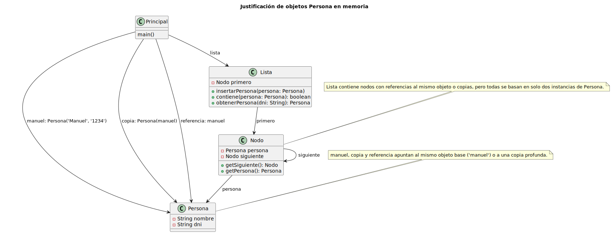
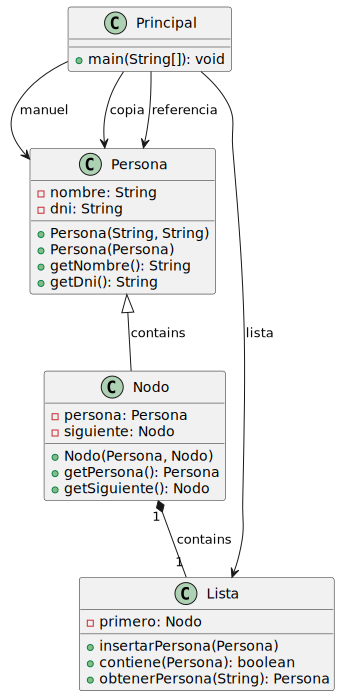
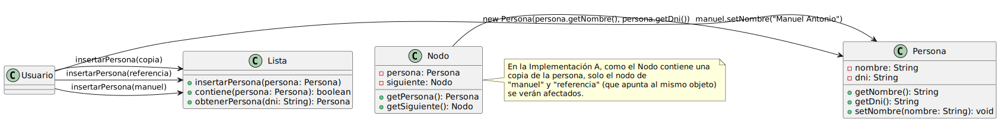
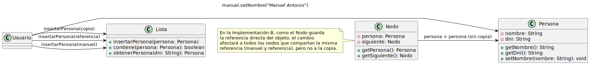

# Respuesta 3

## Marcos Gutiérrez Delgado

### a) ¿Cuántos objetos Persona diferentes hay en memoria? Justifique su respuesta.
#### Si el nodo utilizado es el de la implementación a: 5

Primer objeto Persona
```java
Persona manuel = new Persona("Manuel", "1234");
```

Segundo objeto Persona
```java
Persona copia = new Persona(manuel);
```

`Al crear un nodo se crea un nuevo objeto persona con esta implementación`<br>
Tercer objeto Persona
```java
lista.insertarPersona(manuel);

public Nodo(Persona persona, Nodo siguiente) {
        this.persona = new Persona(persona.getNombre(), persona.getDni());
        this.siguiente = siguiente;
    }
```

`Sucede lo mismo al insertar copia, crea otro objeto Persona`<br>
Cuarto objeto Persona
```java
lista.insertarPersona(copia);

public Nodo(Persona persona, Nodo siguiente) {
        this.persona = new Persona(persona.getNombre(), persona.getDni());
        this.siguiente = siguiente;
    }
```

`Sucede lo mismo al insertar referencia, crea otro objeto Persona`<br>
Cuarto objeto Persona
```java
lista.insertarPersona(referencia);

public Nodo(Persona persona, Nodo siguiente) {
        this.persona = new Persona(persona.getNombre(), persona.getDni());
        this.siguiente = siguiente;
    }
```
[Código UML](Diagramas/a/diagrama3a-a.puml)<br>



#### Si el nodo utilizado es el de la implementación b: 2

Primer objeto Persona
```java
Persona manuel = new Persona("Manuel", "1234");
```

Segundo objeto Persona
```java
Persona copia = new Persona(manuel);
```

En esta implementación el nodo para guardar las personas no crea un objeto nuevo de tipo persona

```java
public Nodo(Persona persona, Nodo siguiente) {
        this.persona = persona;
        this.siguiente = siguiente;
    } 
```

[Código UML](Diagramas/a/diagrama3a-b.puml)<br>


### b) Si hacemos manuel.setNombre("Manuel Antonio"), ¿qué elementos de la lista se verán afectados? ¿Por qué?

#### Si el nodo utilizado es el de la implementación a:
En la implementación **a**, el constructor del `Nodo` crea una nueva instancia de `Persona` copiando los datos del objeto pasado como argumento (`new Persona(persona.getNombre(), persona.getDni())`). Esto significa que cuando se inserta `manuel` en la lista, se crea una **copia** del objeto `manuel` en cada nodo. Por lo tanto, si se realiza el cambio `manuel.setNombre("Manuel Antonio")`, solo se verá afectado el objeto original `manuel`, ya que es el único que mantiene la referencia a la instancia modificada. 

La `copia` no se verá afectada, ya que es un objeto independiente creado con los mismos datos pero en una nueva instancia. El nodo `referencia` tampoco se verá afectado directamente porque `referencia` es simplemente otra referencia al mismo objeto `manuel`, pero no es el mismo objeto dentro de la lista, dado que el nodo de la lista contiene una copia de `manuel`.

**En resumen**, el cambio solo afectaría a `manuel` y `referencia` (ya que ambas variables apuntan al mismo objeto), mientras que el nodo que contiene a `copia` no se verá afectado, ya que es una instancia independiente.

[Código UML](Diagramas/a/diagrama3b-a.puml)<br>


---

#### Si el nodo utilizado es el de la implementación b:
En la implementación **b**, el constructor del `Nodo` asigna directamente la referencia del objeto `persona` al campo `this.persona` sin realizar una copia de los datos. Es decir, el nodo no tiene una copia de los datos de la persona, sino que mantiene una referencia directa al objeto `persona` pasado. 

Por lo tanto, si se realiza el cambio `manuel.setNombre("Manuel Antonio")`, **todos los nodos que contienen una referencia al objeto `manuel` se verán afectados**. Esto incluye el nodo que contiene a `manuel` y el nodo que contiene a `referencia`, ya que ambos están apuntando al mismo objeto `Persona`. 

Por otro lado, el nodo que contiene a `copia` no se verá afectado, ya que `copia` es un objeto completamente independiente creado mediante una copia de `manuel` y no comparte la misma referencia.

[Código UML](Diagramas/a/diagrama3b-b.puml)<br>

