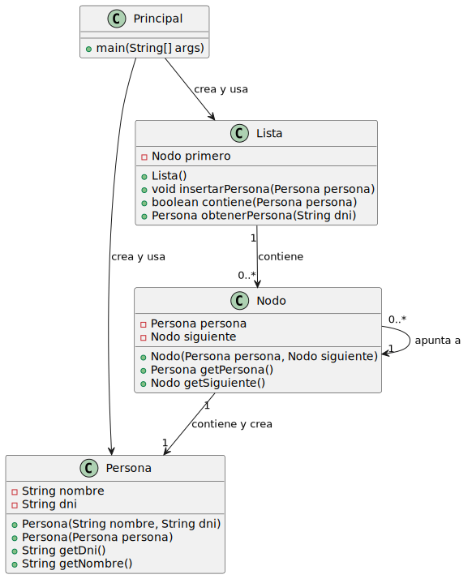
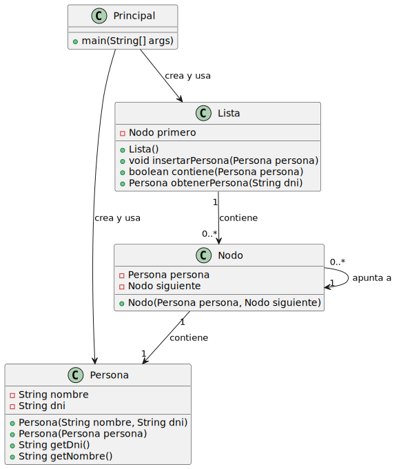

# Respuesta pregunta 3

## Martín López de Novales Gurruchaga

### a)

Si la clase nodo corresponde a la implementación A hay cinco objetos de la clase `Persona`.
Esto se debe a que en un principio se crean dos objetos `manuel` y `copia`. Sin embargo, cuando estos objetos se agregan a la lista `lista` lo que hace esta lista es llamar al constructor de `Nodo` pasándole como parámetro la referencia del objeto de tipo `Persona`. Y al llegar al constructor de este nodo este lo que hace es volver a llamar al constructor de `Persona`, creando así un objeto nuevo.

 

[Código UML y diagrama](https://github.com/martinlopez7/24-25-EDA1-ExamenParcial/tree/a12b79c863ba1cf73f8387facf839f129bd4c02b/respuesta3_MartinLopez/diagramas/apartado_a)

 

Si, por otro lado, la clase `Nodo` correspondiese a la implementación B habría dos objetos de la clase `Persona` en su lugar.
Esto es debido a que en un principio se crean los dos mismos objetos que en un principio, estos son `manuel` y `copia`. Estos objetos son agregados a lista, la cual crea un objeto de la clase `Nodo` llamando a su constructor. Sin embargo, el constructor de la implementacion B de `Nodo`, a diferencia de la implementación A, simplemente guarda el objeto que se le es pasado por parámetro, es decir, no crea otro objeto de la clase `Persona`.

[Código UML y diagrama](https://github.com/martinlopez7/24-25-EDA1-ExamenParcial/tree/a12b79c863ba1cf73f8387facf839f129bd4c02b/respuesta3_MartinLopez/diagramas/apartado_b)

 

En resumen, la implementación A de `Nodo` contiene Y crea objetos de clase `Persona`, sin emabrgo, la implementación B de `Nodo` SOLO contiene objetos de clase `Persona`.

### b)

Si la clase nodo corresponde a la implementación A, ningún elemento de la lista se verá afectado por este cambio en `manuel`, ya que:
Cuando se inserta manuel en la lista, el nodo crea una nueva instancia de Persona con los mismos valores que manuel. Esa nueva instancia es independiente de la original, luego da igual que modifiques el objeto después.
Sin emabrgo el objeto original `manuel` si que se verá afectado.

 

Por otro lado, si la clase `Nodo` correspondiese a la implementación B, además del propio objeto original `manuel`, los elementos `manuel` y `referencia` de la lista se verían alterados ya que, aunque `copia` haya sido creada a partir de `manuel` es un objeto independiente, mientras que `copia` no es un objeto en sí, tan solo es un puntero que referencia a `manuel`.

