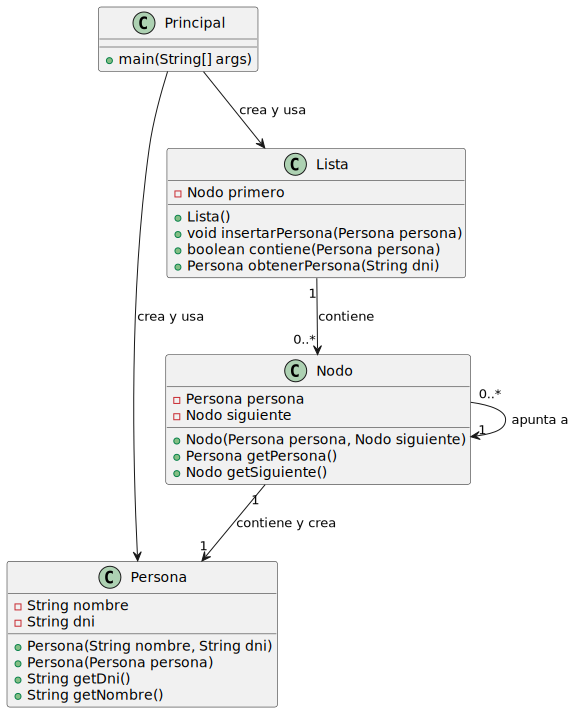

# Pregunta 3

# Implementaciones

## Nodo a:
```java
public class Nodo {
    private Persona persona;
    private Nodo siguiente;
    
    public Nodo(Persona persona, Nodo siguiente) {
        this.persona = new Persona(persona.getNombre(), persona.getDni());
        this.siguiente = siguiente;
    }

    public Nodo getSiguiente(){
        return siguiente;
    }

    public Persona getPersona(){
        return persona;
    }
}
```



## Nodo b:
```java
public class Nodo {
    private Persona persona;
    private Nodo siguiente;
    
    public Nodo(Persona persona, Nodo siguiente) {
        this.persona = persona;
        this.siguiente = siguiente;
    } 

    public Nodo getSiguiente(){
        return siguiente;
    }

    public Persona getPersona(){
        return persona;
    }
}
```


## a)
#### Implementación a
Si la clase Nodo corresponde a la implementación A, se generan cinco instancias de la clase Persona.
Esto ocurre porque inicialmente se crean dos objetos: manuel y copia. Sin embargo, al agregar estos objetos a la lista lista, esta invoca al constructor de Nodo y le pasa como argumento la referencia del objeto de tipo Persona. Dentro del constructor de Nodo, se llama nuevamente al constructor de Persona, lo que da como resultado la creación de un nuevo objeto.

#### Implementación
Si, en cambio, la clase Nodo correspondiera a la implementación B, habría únicamente dos instancias de la clase Persona.
Esto se debe a que inicialmente se crean los mismos dos objetos, manuel y copia. Al agregarlos a la lista, esta instancia un objeto de la clase Nodo mediante su constructor. No obstante, a diferencia de la implementación A, el constructor de la implementación B de Nodo simplemente almacena la referencia al objeto que se le pasa como parámetro, sin crear un nuevo objeto de la clase Persona.

## b)


#### Implementación A

Si la clase `Nodo` sigue la implementación A, **ningún elemento de la lista se verá afectado** por cambios realizados en el objeto original `manuel`. Esto ocurre porque:

- Al insertar el objeto `manuel` en la lista, el nodo no almacena directamente la referencia al objeto existente. En lugar de ello, **crea una nueva instancia de la clase `Persona`** utilizando los valores actuales de `manuel` en ese momento.
- La nueva instancia que se almacena en la lista es completamente **independiente** del objeto original, por lo que cualquier modificación posterior en `manuel` no impactará en la copia almacenada dentro de la lista.

En resumen, los objetos dentro de la lista permanecen inalterados, pero el objeto original `manuel` sí reflejará cualquier cambio que se le haga, dado que no deja de ser un objeto vivo fuera del ámbito de la lista.

---

#### Implementación B

Si la clase `Nodo` sigue la implementación B, el comportamiento será diferente, ya que tanto el objeto `manuel` como algunos elementos de la lista **sí se verán afectados por los cambios realizados en `manuel`**. Esto sucede porque:

- En esta implementación, al insertar el objeto `manuel` en la lista, el nodo no crea una copia independiente. En su lugar, simplemente guarda una **referencia** al objeto original.
- Como resultado, cualquier modificación en `manuel` se reflejará en todos los nodos que lo referencien, incluidos los elementos `manuel` y `referencia` en la lista.
- Aunque `copia` también proviene de `manuel`, es un **objeto independiente** que no comparte la misma referencia, por lo que los cambios en `manuel` no afectan a `copia`.
- En el caso de `referencia`, este no es un objeto nuevo; simplemente actúa como un puntero que señala directamente al objeto original `manuel`, amplificando los efectos de cualquier modificación realizada en este.

En resumen, bajo la implementación B, los cambios en el objeto original se propagan a todos los nodos y referencias que lo apuntan, haciendo que el comportamiento sea más dependiente de la estructura interna de los objetos en la lista.

