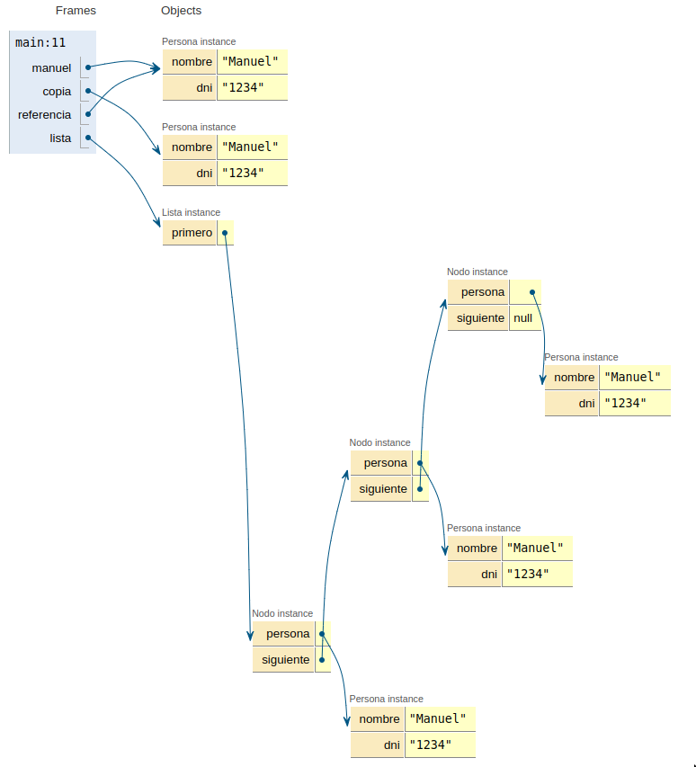
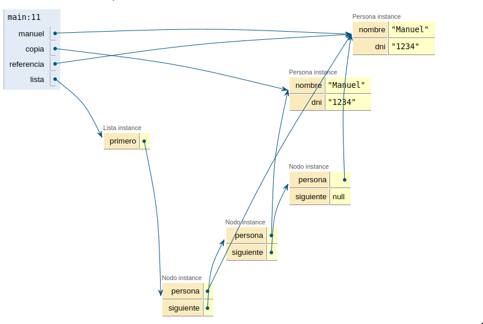
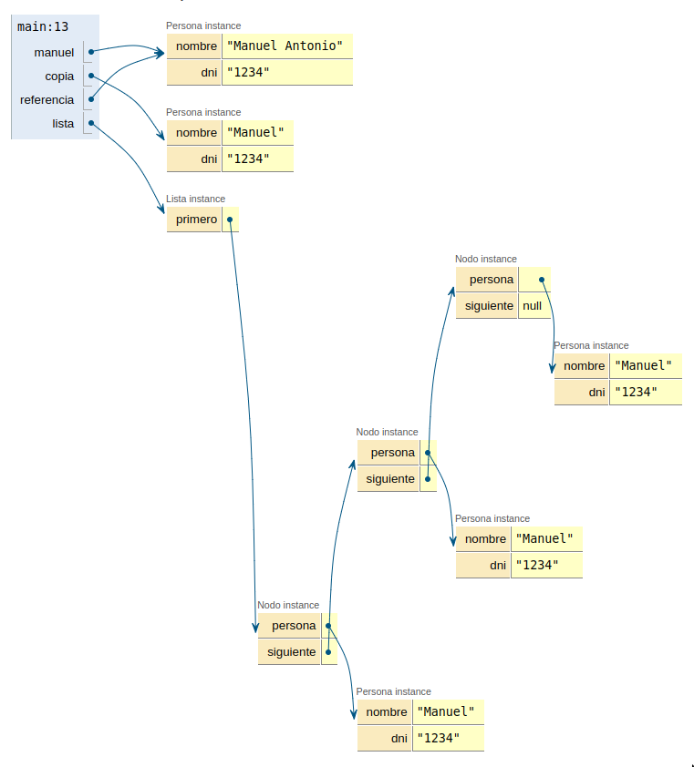
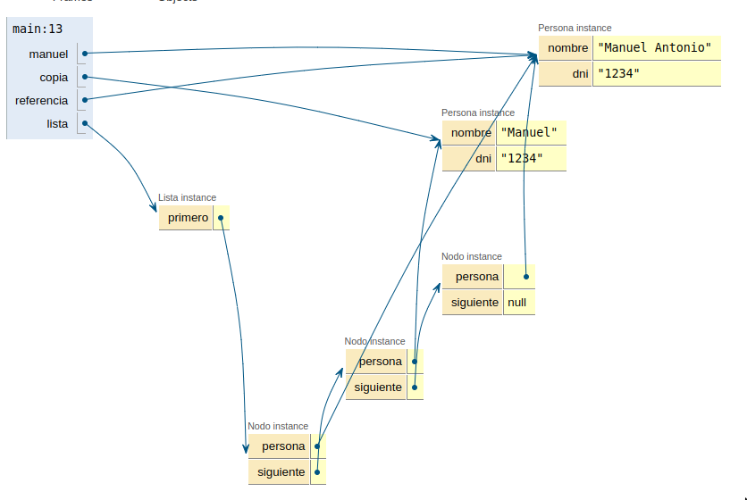

## Pregunta 3: referencias y constructores

Analice este código:

```java
public class Persona {
    private String nombre;
    private String dni;
    
    public Persona(String nombre, String dni) {
        this.nombre = nombre;
        this.dni = dni;
    }
    
    public Persona(Persona persona) {
        this.nombre = persona.nombre;
        this.dni = persona.dni;
    }
}

public class Principal {
    public static void main(String[] args) {
        Persona manuel = new Persona("Manuel", "1234");
        Persona copia = new Persona(manuel);
        Persona referencia = manuel;
        
        Lista lista = new Lista();
        lista.insertarPersona(manuel);
        lista.insertarPersona(copia);
        lista.insertarPersona(referencia);
    }
}
```

||
|-
a) ¿Cuántos objetos Persona diferentes hay en memoria? Justifique su respuesta.
b) Si hacemos `manuel.setNombre("Manuel Antonio")`, ¿qué elementos de la lista se verán afectados? ¿Por qué?

### Respuesta

A) En este caso, la cantidad de objetos dependerá de la implementación del nodo que se utilice. Cabe aclarar que en ambos casos siempre habrá un mínimo de 2 objetos `Persona`:

```java
        Persona manuel = new Persona("Manuel", "1234");
        Persona copia = new Persona(manuel);
        Persona referencia = manuel;
```

- Si se utiliza la implementación de **Nodo A**, habrá un total de 5 objetos `Persona` en memoria.

    


  El código se encuentra en: [CasoA.java](./CasoA.java)

- Si se utiliza la implementación de **Nodo B**, habrá un total de 2 objetos `Persona` en memoria.

    

  El código se encuentra en: [CasoB.java](./CasoB.java)

B) Nuevamente depende de la implementación, como se vio en la respuesta A el comportamiento de los objetos `Persona` varía según la implementación del nodo. En el caso de **Nodo A**, si se modifica el nombre de `manuel`, no se verá afectado ningún elemento de la lista, ya que al insertar una persona a la lista siempre se crea un nuevo objeto `Persona`. En el caso de **Nodo B** afectara al primer y ultimo nodo de la lista, ya que ambos nodos apuntan al mismo objeto.

- Depuración del caso "A"

    

- Depuración del caso "B"

    

